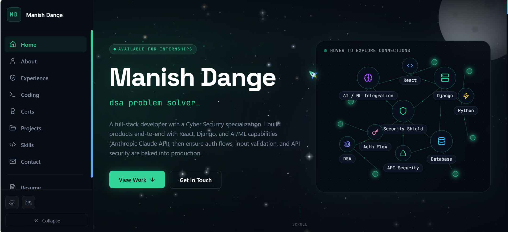

<div align="center">



**Full Stack Developer & Cyber Security Enthusiast**
B.Tech CSE (Cyber Security) · SVVV Indore · 2023–2027

[](https://your-portfolio-url.vercel.app)
[](https://github.com/manish780386)
[](https://linkedin.com/in/manish-dange-2a03b6312)
[](https://leetcode.com/u/dangemanish)

</div>

---

## ✨ Features

- 🌌 **3D Space Background** — Canvas-powered star field with meteors, nebulae, constellations, aurora bands, moon, sun, and floating planets with mouse parallax
- ⚡ **Live Coding Stats** — GitHub, LeetCode, and Codeforces data fetched live on page load
- 🎯 **Custom Cursor** — Airplane SVG cursor with trail particles and click burst (desktop)
- 📱 **Mobile Optimized** — Drastically reduced canvas work on mobile, no blur filters, skip-frame rendering
- 🎨 **Dark Space Theme** — Deep navy/dark aesthetic with cyan-indigo-purple accent palette
- 🔥 **Framer Motion** — Smooth animations throughout — page transitions, scroll reveals, hover effects
- 📊 **CodingProfiles Page** — 4 tabs: Overview, LeetCode deep dive, GitHub repos, DSA topics
- 🛠️ **Skills Grid** — Real SVG tech icons with per-skill color glow on hover
- 📂 **Projects Section** — 3 published products (VS Code + PyPI) + 4 full-stack web projects
- 📜 **Resume Page** — Inline web resume with timeline + download option
- 🏅 **Certifications** — Tap to open modal with certificate details
- 🎓 **Experience & Education** — Expandable timeline with marksheet upload support

---

## 🛠️ Tech Stack

| Layer | Technology |
|-------|-----------|
| Framework | React 18 + Vite |
| Styling | Tailwind CSS v4 |
| Animations | Framer Motion |
| Routing | React Router DOM v6 |
| Scroll | React Scroll |
| Icons | Lucide React |
| Counters | React CountUp |
| Observer | React Intersection Observer |
| Notifications | React Hot Toast |
| Canvas | HTML5 Canvas API |
| Fonts | Space Grotesk + Inter + JetBrains Mono |

---

## 📁 Project Structure

```
portfolio/
├── public/
│   ├── screenshots/        ← Project screenshots (add your own)
│   └── certs/              ← Certificate images (add your own)
├── src/
│   ├── assets/
│   │   └── manish.png      ← Your photo
│   ├── components/
│   │   ├── StarField.jsx   ← 3D space background (mobile optimized)
│   │   ├── CustomCursor.jsx
│   │   ├── Navbar.jsx
│   │   ├── Footer.jsx
│   │   ├── SectionWrapper.jsx
│   │   └── StatusChip.jsx
│   ├── hooks/
│   │   └── useLiveCodingStats.js  ← Live GitHub + LeetCode + CF fetch
│   ├── sections/
│   │   ├── Hero.jsx
│   │   ├── About.jsx
│   │   ├── Skills.jsx
│   │   ├── Projects.jsx
│   │   ├── CodingProfiles.jsx
│   │   ├── Experience.jsx
│   │   ├── Certifications.jsx
│   │   └── Contact.jsx
│   ├── pages/
│   │   └── ResumePage.jsx
│   ├── App.jsx
│   ├── main.jsx
│   └── index.css
├── index.html
├── vite.config.js
├── tailwind.config.js
└── package.json
```

---

## 🚀 Getting Started

### Prerequisites
- Node.js 18+
- npm or yarn

### Installation

```bash
# 1. Clone the repo
git clone https://github.com/manish780386/portfolio.git
cd portfolio

# 2. Install dependencies
npm install

# 3. Start dev server
npm run dev
```

Open [http://localhost:5173](http://localhost:5173) in your browser.

### Build for Production

```bash
npm run build
```

Output goes to `/dist` — deploy to Vercel, Netlify, or GitHub Pages.

---

## 📦 Dependencies

```bash
npm install react-router-dom framer-motion react-scroll react-hot-toast react-countup react-intersection-observer lucide-react
```

---

## 🌐 Deployment (Vercel — Recommended)

```bash
# Option 1: Vercel CLI
npm install -g vercel
vercel login
vercel --prod

# Option 2: GitHub Integration
# Push to GitHub → Import on vercel.com → Deploy (zero config)
```

---

## 📸 Adding Screenshots

Put project screenshots in `public/screenshots/` and update the `screenshot` field in `Projects.jsx`:

```js
screenshot: "/screenshots/tripkar.png",
```

---

## 🏅 Adding Certificate Images

Put certificate soft copies in `public/certs/` and update the `image` field in `Certifications.jsx`:

```js
image: "/certs/nptel-iot.jpg",
```

---

## 📊 Live Coding Stats

The `useLiveCodingStats.js` hook fetches live data from:

| Platform | API | Notes |
|----------|-----|-------|
| GitHub | `api.github.com` | Repos, stars, followers |
| LeetCode | `leetcode-stats.tashif.codes` | Solved count, difficulty split |
| Codeforces | `codeforces.com/api` | Unique accepted problems via `user.status` |

All three have fallback values — works even if APIs are down.

---

## 🔧 Customization

### Update your info
Edit the constants at the top of each section file:
- `Hero.jsx` — name, tagline, socials
- `CodingProfiles.jsx` — platform handles, stats
- `Projects.jsx` — project data, GitHub URLs
- `Certifications.jsx` — cert list, images
- `Experience.jsx` — work + education timeline

### Change accent color
In `index.css`:
```css
--color-accent: #34d399;   /* change this */
```

### Mobile performance
`StarField.jsx` auto-detects mobile via `useState + useEffect` (SSR safe) and:
- Reduces star count from 417 → 83
- Disables blur filters, aurora, particles
- Skips every other canvas frame
- Slows meteor interval to 6.5s

---

## 📬 Contact

| | |
|--|--|
| 📧 Email | [dangemanish35@gmail.com](mailto:dangemanish35@gmail.com) |
| 📱 Phone | +91 7903861195 |
| 🌍 Location | Indore, Madhya Pradesh, India |
| 💼 LinkedIn | [manish-dange-2a03b6312](https://linkedin.com/in/manish-dange-2a03b6312) |
| 🐙 GitHub | [manish780386](https://github.com/manish780386) |
| ⚡ LeetCode | [dangemanish](https://leetcode.com/u/dangemanish) |
| 🦉 Codolio | [manishdange](https://codolio.com/profile/manishdange) |

---

## 📄 License

MIT License — feel free to use this as a template for your own portfolio.

If you do, a star ⭐ would be appreciated!

---

<div align="center">

**Built with ❤️ in Indore, India**
*React + Vite + Tailwind CSS + Framer Motion*
